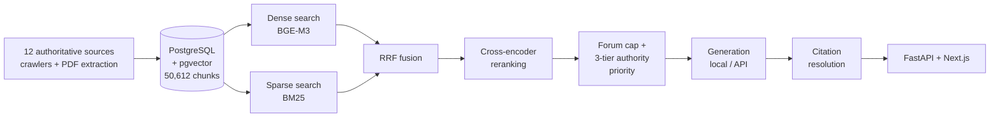

# ACTIA

**A retrieval-augmented question-answering system for French social-security and labour law — built to measure what a locally-hosted open-weight model actually costs you in answer quality, compared to a commercial API.**

ACTIA answers case questions for *assistants de service social* (social workers) , people advising real clients on sick leave, invalidity pensions, retirement, family benefits and workplace accommodation, where a wrong answer has consequences and an unsourced answer is unusable.

The interesting engineering question isn't "can an LLM answer these?" — it's **what do you give up by running the model on your own hardware instead of sending client data to a commercial API?** That question has a real answer here, measured rather than asserted.

---

## The headline result

Three models, **identical retrieval context**, 48 real case questions, judged by RAGAS with an independent third model:

| Model | Hosting | Faithfulness | Sources actually cited | Cost / query |
|---|---|---|---|---|
| GPT-4o-mini | Commercial API | **0.712** | **33.0%** | $0.00122 |
| Mistral-7B | Local (CPU) | 0.538 | 2.0% | ~$0 |
| Qwen2.5-7B | Local (CPU) | 0.465 | 2.6% | ~$0 |

**Retrieval quality is near-identical across all three** (Context Precision 0.715–0.738) — the gap is entirely generation-side. Local models receive exactly the same evidence and fail to use it faithfully.

The citation column is the sharper finding: local models produce `[N]` citations in under 3% of the sources they're given, versus 33% for the commercial model — despite an explicit instruction to cite, in the same prompt. For a legal-advice tool where a social worker must verify every claim, that's not a cosmetic gap.

---

## Architecture



**Corpus** — 43,672 documents / 50,612 chunks, crawled from 12 sources — Légifrance, Ameli (fiches + forum), Service-Public, France Travail, CARSAT, URSSAF, CAF, travail-emploi.gouv.fr, la-retraite-en-clair, the Assemblée Nationale — plus a partner organisation's internal practice guides. Every document carries a `legal_status` tag distinguishing codified law from binding administrative doctrine from non-binding forum testimony — which the retriever then acts on.

**Retrieval** — hybrid dense + sparse with RRF fusion, cross-encoder reranking, taxonomy-based topic filtering, a three-tier source-authority guarantee (internal guides → legislative/doctrine → forum), a hard cap on forum chunks, and a bounded backfill retry when capping thins the pool below *k*.

**Generation** — pluggable backends (Ollama for local models, Mistral and OpenAI APIs), one byte-identical system prompt across all conditions so the only variable is the model, and post-hoc citation resolution that validates every `[N]` marker against the sources actually supplied.

---

## Engineering results

Each of these is a measured before/after on a fixed benchmark, not an estimate.

**Reranking cost cut 2.35×, with no retrieval quality loss.** Reranking was the dominant latency cost (~1.5–2s per candidate on CPU, unbounded pool). Capping it to the top 30 fusion-ranked candidates:

| | before | after |
|---|---|---|
| sec / query | 334.5 | **142.3** |
| Recall@5 | 0.583 | 0.625 |
| MRR | 0.341 | 0.368 |

**Embedding model chosen by benchmark, not reputation.** The *a priori* assumption — that a French-only model would win on a 100%-French corpus — was tested and turned out to be wrong:

| | Recall@1 | Recall@5 | MRR |
|---|---|---|---|
| camembert-large (French-only) | 0.333 | 0.667 | 0.490 |
| multilingual-e5-large | 0.500 | 0.750 | 0.595 |
| **BGE-M3** (selected) | 0.500 | **0.958** | **0.665** |

**Topic filtering validated before being enabled**, on a 15-question A/B with everything else held constant: weak-recall questions improved **+0.141** mean recall (0.274 → 0.416), already-strong questions +0.036. Three regressions were found and are reported rather than averaged away — each traced to the same cause, incomplete topic tagging on multi-faceted questions.

**Six retrieval bugs found and fixed empirically**, including a BM25 implementation missing IDF and length normalisation, a silent HNSW ceiling capping the candidate pool at 40 regardless of requested size, and a source-authority bias where 269 forum chunks crowded the single correct official source out of the top-8.

**Resource profile measured, not guessed** — peak RSS 4.67 GB (Qwen generation) and 4.03 GB (retrieval models) against a 7.4 GB machine, which is *why* retrieval runs in a disposable subprocess: the two cannot be resident simultaneously. Energy measured with CodeCarbon at 0.826 Wh/query (CPU-load estimated, not RAPL — the host is WSL2 with no hardware counters exposed).

---

## Evaluation harness

Model selection here is measurement, not opinion. The harness scores every condition on:

- **Faithfulness** — are the answer's claims supported by the retrieved context?
- **Context Recall / Precision** — did retrieval find what the reference answer needs, and was what it found useful?
- **Citation validity** — does every `[N]` marker resolve to a real supplied source? (structural check, independent of the LLM judge)
- **Abstention** — answered / partial / abstained, classified over all 144 answers
- **Error attribution** — each failure classified as *retrieval* (the evidence never arrived) or *generation* (it arrived and was misused), with threshold-sensitivity analysis
- **Frugality** — per-query cost, energy, latency, model size on disk, peak RAM

One finding worth singling out: **Qwen2.5-7B never abstains** — not once across 48 questions — despite being the least faithful of the three models. It answers confidently or hedges, but never declines. GPT-4o-mini declines 5 times.

---

## Running it

```bash
docker compose up -d                      # PostgreSQL + pgvector
pip install -r requirements.txt
psql -f storage/schema.sql                # schema
python -m storage.load_postgres           # chunk + load corpus
uvicorn api.main:app --port 8000          # API
cd web && npm install && npm run dev      # UI on :3000
```

Create a `.env` with `POSTGRES_*`, and `MISTRAL_API_KEY` / `OPENAI_API_KEY` for the API backends. Local models run through [Ollama](https://ollama.com) and need no key.

---

## Honest limitations

Stated here because they bound what the results above mean.

- **Not deployable as-is.** End-to-end latency is ~6 minutes per query on CPU (142s retrieval + ~215s generation). Reaching interactive speed needs GPU-served inference, not further CPU tuning.
- **Citation enforcement works but is impractical here.** Schema-constrained decoding makes an invalid citation *structurally impossible* to emit — and runs at 0.3 tokens/second on this hardware, ~60× slower than free-text generation. Implemented, measured, and documented as GPU-dependent rather than shipped.
- **Small samples, no significance testing.** n=48 on the main comparison, n=24 on retrieval, n=12–15 elsewhere. All findings are descriptive; no confidence intervals are computed.
- **The LLM judge is unvalidated.** RAGAS scores come from a judge model that has never been checked against human labels on this corpus.
- **No professional evaluation.** No social worker has ever assessed an answer. Every number here is automated.
- **Judge non-determinism.** No temperature is pinned on the judge, so identical inputs can score slightly differently between runs — visible in the data as recall varying across models that received byte-identical context.
- **One taxonomy domain is untested** — no evaluation question matched `métier AS` (professional-practice questions), so that part of the corpus is unexercised.

---

## Repository contents

```
ingestion/    crawlers, extractors, PDF parsing, taxonomy tagging  (12 sources)
storage/      schema, chunking, embedding, hybrid retrieval, reranking
generation/   prompts, multi-backend generation, citation resolution/enforcement
evaluation/   RAGAS harness, benchmarks, error attribution, frugality measurement
api/          FastAPI service
web/          Next.js frontend with clickable, validated citations
experiments/  embedding-model and retrieval benchmarks
```

**Not included**: the crawled corpus, the evaluation question set, and derived result files. They contain unanonymised case questions from a partner organisation's internal archive, internal professional guides, and forum content ingested under a non-commercial research-only restriction. The code that processes them is here; the content is not.

---

*Built as a master's thesis project. The system is a research prototype — the measurements are the deliverable, not a production deployment.*
